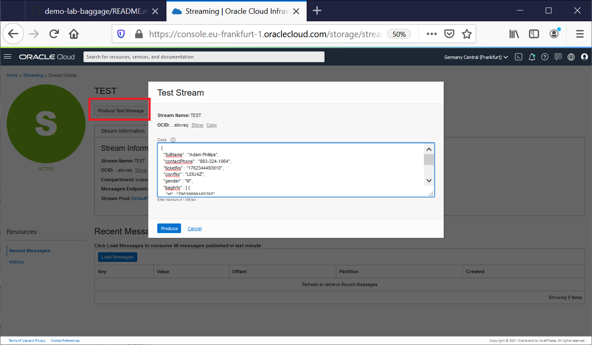

# WORKSHOP OUTLINE
1. Setup
2. NoSQL 
3. Execute and Review Code Functions
4. Execute Streaming tests 
5. Execute API tests
6. Review Streaming/API/Functions configuration


## LAB1 - Setup

### Step 1. Create a compartment 
Go to OCI console -> Identity & Security -> Compartments.

Click on Create Compartment. This opens up a new window.

Choose **demonosql** as compartment name, choose a description and add it.

### Step 2. Create an API Key and Auth Token for your user

Login to OCI console.

Click on your Profile -> User Settings. On the bottom left, click on Auth Tokens. Click on Generate Token.

Provide a description and then hit Generate Token. This will generate a token. **Make sure to copy the token and save it for future steps**.

### Step 3. Deploy the PoC application

To deploy the application, we will use a terraform scripts provided for this Lab. 

Click on button right in order to Open Link in New Tab [](https://cloud.oracle.com/resourcemanager/stacks/create?region=home&zipUrl=https://github.com/dario-vega/demo-lab-baggage/archive/refs/heads/main.zip)

Provide your **Cloud Account Name** and click on Next

Login in your account using your credentials

Click on the box "I have reviewed and accept the Oracle Terms of Use."

Click on Next

Configure the variables for the infrastructure resources that this stack will create when you run the apply job for this execution plan.
Choose demonosql as _Compartment_, Provide your username in the text box _OCIR username_ then the token copied in step2 _OCIR user password_

Click on Next

Review and Click on Create

A job will run automatically. It takes 5 minutes. Wait still State becomes Succeeded

### Step 4. Cloud Shell Configuration - clone github, execute shell data.sh and setup the fn env.

Open the Cloud Shell (click in the icon > ) in the top right menu

````
git clone https://github.com/dario-vega/demo-lab-baggage
sh ~/demo-lab-baggage/data.sh
````

Go to OCI console -> Developer Services -> Applications

On the left List Scope - Compartment - choose demonosql compartment

Click on nosql_demos application

On the left choose Getting Started

Click on Cloud Shell Setup

Execute the steps 1 to 7 provided in this Wizard 

Note: In the step 4 replace [OCIR-REPO] by nosql_demos


### Step 5. Create the dynamic group and the policies 

Use the guidelines are provided in  [./privs/dynamic-group](./privs/dynamic-group) directory


## LAB2 NoSQL

### Step 1. NoSQL Tables Deployment

Open the Cloud Shell (click in the icon > ) in the top right menu. Use the following instructions


Creating NoSQL tables using oci-cli - DDL for create tables in this [directory](./objects) (e.g demo.nosql)
```
cd ~/demo-lab-baggage/objects
COMP_ID=`oci iam compartment list --name  demonosql | jq -r '."data"[].id'`
echo $COMP_ID
DDL_TABLE=$(cat demo.nosql)
echo $DDL_TABLE

oci nosql table create --compartment-id "$COMP_ID"   \
--name demo --ddl-statement "$DDL_TABLE" \
--table-limits="{\"maxReadUnits\": 15,  \"maxStorageInGBs\": 1,  \"maxWriteUnits\": 15 }"

DDL_TABLE=$(cat demoKeyVal.nosql)
echo $DDL_TABLE

oci nosql table create --compartment-id "$COMP_ID"   \
--name demoKeyVal  --ddl-statement "$DDL_TABLE" \
--table-limits="{\"maxReadUnits\": 15,  \"maxStorageInGBs\": 1,  \"maxWriteUnits\": 15 }"

```

This section is for information purpose only: How to create a NoSQL tables Using Terraform.

```
## This configuration was generated by terraform-provider-oci

resource oci_nosql_table export_demoKeyVal {
  compartment_id = var.compartment_ocid
  ddl_statement  = "CREATE TABLE IF NOT EXISTS demoKeyVal ( key INTEGER GENERATED ALWAYS AS IDENTITY (START WITH 1 INCREMENT BY 1 NO CYCLE ), value JSON, PRIMARY KEY (key))"
  defined_tags = {
  }
  freeform_tags = {
  }
  is_auto_reclaimable = "false"
  name                = "demoKeyVal"
  table_limits {
    max_read_units     = "10"
    max_storage_in_gbs = "1"
    max_write_units    = "10"
  }
}


resource oci_nosql_table export_demo {
  compartment_id = var.compartment_ocid
  ddl_statement  = "CREATE TABLE if not exists demo(\n  fullName     STRING,\n  contactPhone STRING,\n  ticketNo     STRING,\n  confNo       STRING,\n  gender       STRING,\n  bagInfo      JSON,\n PRIMARY KEY ( ticketNo )\n )"
  defined_tags = {
  }
  freeform_tags = {
  }
  is_auto_reclaimable = "false"
  name                = "demo"
  table_limits {
    max_read_units     = "10"
    max_storage_in_gbs = "1"
    max_write_units    = "10"
  }
}

```

Minimize Shell Cloud Console

### Step 2. Adding Data to the NoSQL table from the OCI Console 

Go to OCI console -> Databases -> Oracle NoSQL Database - Tables

On the left List Scope - Compartment - choose demonosql compartment

Click on demo table

Click on Insert Row. This opens up a new window. Choose Advanced Json Input 

Copy/Paste the json Baggage document in JSON input text box

Click on Insert ROw

### Step 3.  Show data from the Console

On the left Click on Table Rows

In the textbox Query, keep the text SELECT * FROM demo

Click on Run query 

###  Show queries - Working in progress

```
cd ~/demo-lab-baggage/objects
cat queries.sql

```

## LAB3  Execute and Review Code Functions

### Step 1 Review and Execute the code

Open the Cloud Shell (click in the icon > ) in the top right menu. 


Execute the following instructions, it is mandatory for next Steps - if you close/open the Cloud Shell Console, please reexecute

```
COMP_ID=`oci iam compartment list --name  demonosql | jq -r '."data"[].id'`
echo $COMP_ID
export APP_NAME="nosql_demos"

```

### Step 2 Load data in the table

The goal of this lab is to understand the difference betweent the 2 data model proposed.

This function will load lines in the table demoKeyVal


```
cd ~/demo-lab-baggage/functions-fn
cd load/demo-keyval-load
cat ~/BaggageData/baggage_data_file99.json | fn invoke $APP_NAME demo-keyval-load
cat ~/BaggageData/baggage_data_file99.json | fn invoke $APP_NAME demo-keyval-load
cat ~/BaggageData/baggage_data_file103.json  | fn invoke  $APP_NAME demo-load
```

Use the steps in the previous Lab to read the data for this table 


This function will load lines in the table demo

```
cd ~/demo-lab-baggage/functions-fn
cd load/demo-load
cat ~/BaggageData/baggage_data_file99.json | fn invoke  $APP_NAME demo-load | jq
cat ~/BaggageData/baggage_data_file99.json | fn invoke  $APP_NAME demo-load | jq
cat ~/BaggageData/baggage_data_file103.json  | fn invoke  $APP_NAME demo-load
```

### Step 3 Read data using a REST API application

In this first step, we will review the code and trigger the fuction manually using the `fn invoke` cli command.

In the nexts Labs, we will trigger the same function using an Endpoint from your API/Web browser. Integration with API Gateway

```
cd ~/demo-lab-baggage/functions-fn
cd api/demo-api

echo '{"ticketNo":"1762386738153", "endPoint":"getBagInfoByTicketNumber"}' | fn invoke $APP_NAME demo-api | jq
echo '{"endPoint":"getBagInfoByTicketNumber"}' | fn invoke $APP_NAME demo-api | jq
echo '{"endPoint":"getBagInfoByTicketNumber"}' | fn invoke $APP_NAME demo-api | jq '. | length'
```
As you can see The getPassengersAffectedByFlight is still under construction
In the next Lab, we will proceed to implement this function with you
In the meantime, some queries that you can run from the console

````
SELECT * FROM demo d where d.bagInfo.flightLegs.flightNo =ANY "BM715"

SELECT d.fullName, d.contactPhone, d.ticketNo , d.bagInfo.flightLegs.flightNo as bagInfo FROM demo d where d.bagInfo.flightLegs.flightNo =ANY "BM715"

SELECT d.fullName, d.contactPhone, d.ticketNo , d.bagInfo.flightLegs.flightNo as bagInfo
FROM demo d where d.bagInfo.flightLegs.flightNo =ANY "BM715" AND d.bagInfo.flightLegs.flightNo =ANY "BM204"

SELECT d.fullName, d.contactPhone, d.ticketNo , d.bagInfo.flightLegs.flightNo as bagInfo
FROM   demo d 
where  d.bagInfo.flightLegs.flightNo =ANY "BM715" 
AND    d.bagInfo.flightLegs.flightNo =ANY "BM204"
AND    size(d.bagInfo.flightLegs) = 2

````


### Step 4 Load Data using Streaming


In this first step, we will review the code and trigger the fuction manually using the `fn invoke` cli command.

In the nexts labs, we will trigger the same function using Streams. Integration with Streaming and Service Connector


```
cd ~/demo-lab-baggage/functions-fn
cd streaming/load-target
var1=`base64 -w 0 ~/BaggageData/baggage_data_file99.json`
cp test_templ.json stream_baggage_data_file99.json
sed -i "s/<here>/$var1/g"  stream_baggage_data_file99.json

fn invoke $APP_NAME load-target < stream_baggage_data_file99.json

```


## LAB4 Execute Streaming tests

Go to OCI console -> Databases -> Analytics & AI -> Messaging -Streaming

On the left List Scope - Compartment - choose demonosql compartment

Click on nosql_demos

Click on Produce Test Message

Publishing messages to the Stream instance from the OCI Console (copy/paste the json Baggage document in Data text box.).



using OCI cli commands in order to simulate real-time traffic from the Cloud Shell

````
cd ~/demo-lab-baggage/functions-fn
cd streaming/load-target
COMP_ID=`oci iam compartment list --name  demonosql | jq -r '."data"[].id'`
STREAM_OCID=`oci streaming admin stream list --compartment-id $COMP_ID --name nosql_demos --lifecycle-state ACTIVE | jq -r '."data"[].id'`
STREAM_ENDPOINT=`oci streaming admin stream list --compartment-id $COMP_ID --name nosql_demos --lifecycle-state ACTIVE | jq -r '."data"[]."messages-endpoint"'`
echo $COMP_ID
echo $STREAM_OCID
echo $STREAM_ENDPOINT

for file in `ls -1 ~/BaggageData/baggage_data* | tail -20`; do
  echo $file
  filename=`basename $file` 
  var1=`base64 -w 0 $file`
  cp stream_oci_cli_templ.json stream_oci_cli_$filename
  sed -i "s/<here>/$var1/g"  stream_oci_cli_$filename
  oci streaming stream message put --stream-id  $STREAM_OCID \
  --messages file://stream_oci_cli_$filename --endpoint $STREAM_ENDPOINT
  sleep 2
done
````


## LAB5 Execute API tests

Execute the following commmands
````
IFS=$'\n'
unset ticketNo
COMP_ID=`oci iam compartment list --name  demonosql | jq -r '."data"[].id'`
HOSTAPI=`oci api-gateway gateway list --compartment-id $COMP_ID --lifecycle-state ACTIVE --display-name nosql_demos | jq -r '."data".items[]."hostname"'`
URL="https://$HOSTAPI/BaggageDemo/getBagInfoByTicketNumber"

echo $HOSTAPI
echo $URL
````
Click on the URL provided, This opens up a new Tab with the Result to call the getBagInfoByTicketNumber Endpoint API


using CURL to simulate multiples call for each ticketNo


````


ticketNo=($(curl ${URL} | jq -r '[.[].ticketNo] | .[]?'	))
for (( i=0; i<${#ticketNo[@]}; i++ )); do
   curl -X GET -k -d '{"name":"${ticketNo[i]}"}' "${URL}?ticketNo=${ticketNo[i]}" 2>/dev/null | jq
   sleep 2
done
````

## LAB6  Review Streaming/API/Functions configuration

Show OCI Console

