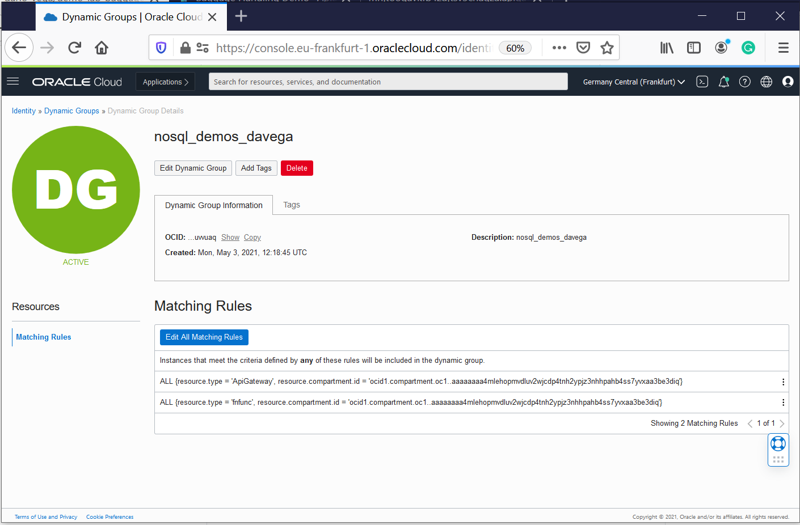
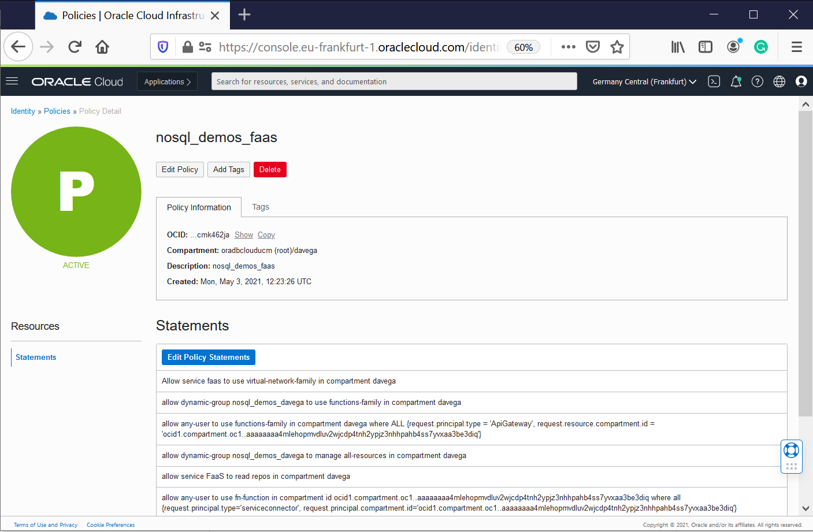

# demo-lab-baggage 

The multi-tier application has been the most used architecture pattern for decades. The multi-tier pattern provides good guidelines for you to follow to ensure decoupled and scalable application components that can be separately managed and maintained.

## The Serverless Logic Tier
The logic tier of the three-tier architecture represents the brains of the application. Integrating API Gateway, Streams and functions to form your logic tier can be so revolutionary.
The features of the two services allow you to build a serverless production application that is highly available, scalable, and secure. Your application could use thousands of servers, however by leveraging this pattern you do not have to manage even a single one. 

In addition, by using these managed services together you gain the following benefits: 
*	No operating systems to choose, secure, patch, or manage.
*	No servers to right size, monitor, or scale out. 
*	No risk to your cost by over-provisioning. 
*	No risk to your performance by under-provisioning.

🎓 **Learn and Discover why NoSQL Cloud Services and OCI native services are compelling**

## DEMO API

A common requirement is to build an API with serverless functions as a back end, and an API gateway providing front-end access to those functions. This is the scenario that we want to illustrate. Create a [function](./functions-fn/api/demo-api/func.js) which read the data from NoSQL table and implementing the logic tier.

The API Gateway service enables you to publish APIs with private endpoints that are accessible from within your network, and which you can expose with public IP addresses if you want them to accept internet traffic. The endpoints support API validation, request and response transformation, CORS, authentication and authorization, and request limiting. 

You can add serverless function back ends to an API deployment specification by using the Console. You can also do this by using Terraform.

Then **USE** the endpoint to access the Data from your favorite API Browser:


- https://ibjktcfgy3nuktwxv73doau3ae.apigateway.eu-frankfurt-1.oci.customer-oci.com/BaggageDemo/demo-api
- https://ibjktcfgy3nuktwxv73doau3ae.apigateway.eu-frankfurt-1.oci.customer-oci.com/BaggageDemo/demo-api?ticketNo=1762386738153

The API gateways you create with the API Gateway service are TLS-enabled, and therefore require TLS certificates (formerly SSL certificates) issued by a Certificate Authority to secure them. To specify a particular custom domain name for an API gateway, you must obtain a custom TLS certificate from a Certificate Authority yourself, rather than have the API Gateway service obtain a TLS certificate for you.

Apiary provides you with the ability to design APIs using either API Blueprint or Swagger. From these description files, Oracle Apiary generates interactive documentation and a console for making calls to the APIs from the UI. Apiary interactive documentation is an interactive representation of your API Description for you to not only read and write, but to be a place where you can interact with your API—even before you’ve built it
Apiary was used in our project as a very powerful tool for **Collaboration and Interactions**. 

https://foo179.docs.apiary.io/#


## DEMO Service Connector (Streaming-Function)

Service Connector Hub is a cloud message bus platform that offers a single pane of glass for describing, executing, and monitoring movement of data between services in Oracle Cloud Infrastructure. 

Service Connector Hub orchestrates data movement between services in Oracle Cloud Infrastructure. 

This scenario involves creating the [load-target](./functions-fn/streaming/load-target/func.py ) function and then referencing that function in a service connector (Service Connector Hub)  to process and move log data from Streaming to a NoSQL table.

To test, you just need to Publishing Messages to the Stream instance from OCI Console (copy/paste the json document in Data text box.). 

**NB** Be aware that we are not Handling large messages (larger than the 1 MB limit)


## DEMO NoSQL and Functions 👷 ⏰ 🛠️

Oracle NoSQL Database Cloud Service is a fully managed database cloud service that is designed for database operations that require predictable, single digit millisecond latency responses to simple queries. NoSQL Database Cloud Service allows developers to focus on application development rather than setting up cluster servers, or performing system monitoring, tuning, diagnosing, and scaling. 

Once you are authenticated against your Oracle Cloud account, you can create a NoSQL table, and specify throughput and storage requirements for the table. Oracle reserves and manages the resources to meet your requirements, and provisions capacity for you. Capacity is specified using read and write units for throughput and GB for storage units

As a developer, you can connect to the Oracle NoSQL Database Cloud Service and work with NoSQL tables using the NoSQL SDKs available in multiple languages

**In this demo, we will use NoSQL Database Python SDK and NoSQL Database Node.js SDK in conjuction with Oracle Functions.**

Oracle Functions is a fully managed, multi-tenant, highly scalable, on-demand, Functions-as-a-Service platform. It is built on enterprise-grade Oracle Cloud Infrastructure and powered by the Fn Project open source engine. Use Oracle Functions (sometimes abbreviated to just Functions) when you want to focus on writing code to meet business needs. 

To enable a function to access another Oracle Cloud Infrastructure resource, you have to include the function in a dynamic group, and then create a policy to grant the dynamic group access to that resource. **In this demo, we will show you how to use Resource Principals to do the connection to NoSQL Cloud Service.** 

Having set up the policy and the dynamic group, you can then include a call to a 'resource principal provider' in your function code. The resource principal provider uses a resource provider session token (RPST) that enables the function to authenticate itself with other Oracle Cloud Infrastructure services. The token is only valid for the resources to which the dynamic group has been granted access. 

**Dynamic groups** allow you to group Oracle Cloud Infrastructure compute instances as "principal" actors (similar to user groups). You can then create policies to permit instances to make API calls against Oracle Cloud Infrastructure services. When you create a dynamic group, rather than adding members explicitly to the group, you instead define a set of matching rules to define the group members



**Oracle NoSQL Database Cloud Service uses Oracle Cloud Infrastructure Identity and Access Management to provide secure access to Oracle Cloud.** Oracle Cloud Infrastructure Identity and Access Management enables you to create user accounts and give users permission to inspect, read, use, or manage tables. 

For demo purpose, I am providing all rights to the Dynamic Group created in my compartment
```
allow dynamic-group DV_APIGATEWAY to manage all-resources in compartment DARIO
```


You can find more information about NoSQL Privileges in the documentation- [Policy Reference] (https://docs.oracle.com/en/cloud/paas/nosql-cloud/csnsd/policy-reference.html#GUID-C194529F-2B38-4BDE-9777-2D3C0CF248D3)




**NoSQL Database Node.js SDK**
```
function createClientResource() {
  return  new NoSQLClient({
    region: Region.EU_FRANKFURT_1,
    compartment:'ocid1.compartment.oc1..aaaaaaaamgvdxnuap56pu2qqxrcg7qnvb4wxenqguylymndvey3hsyi57paa',
    auth: {
        iam: {
            useResourcePrincipal: true
        }
    }
  });
}
```
**NoSQL Database Python SDK**
```
def get_handle():
     provider = borneo.iam.SignatureProvider.create_with_resource_principal()
     config = borneo.NoSQLHandleConfig('eu-frankfurt-1', provider).set_logger(None)
     return borneo.NoSQLHandle(config)
```

## IaC - NoSQL Tables Deployment Documentation V0

Creating NoSQL tables using oci-cli - [tables](./objects)
```
cd objects 
DDL_TABLE=$(cat demo.nosql)
oci nosql table create --compartment-id ocid1.compartment.oc1..aaaaaaaamgvdxnuap56pu2qqxrcg7qnvb4wxenqguylymndvey3hsyi57paa   \
--name demo --ddl-statement "$DDL_TABLE" \
--table-limits="{\"maxReadUnits\": 15,  \"maxStorageInGBs\": 1,  \"maxWriteUnits\": 15 }"

DDL_TABLE=$(cat demoKeyVal.nosql)
oci nosql table create --compartment-id ocid1.compartment.oc1..aaaaaaaamgvdxnuap56pu2qqxrcg7qnvb4wxenqguylymndvey3hsyi57paa   \
--name demoKeyVal  --ddl-statement "$DDL_TABLE" \
--table-limits="{\"maxReadUnits\": 15,  \"maxStorageInGBs\": 1,  \"maxWriteUnits\": 15 }"
```

Creating NoSQL tables Using Terraform (use the demo-lab-baggage-terraform.zip provided)

```
## This configuration was generated by terraform-provider-oci

resource oci_nosql_table export_demoKeyVal {
  compartment_id = var.compartment_ocid
  ddl_statement  = "CREATE TABLE IF NOT EXISTS demoKeyVal ( key INTEGER GENERATED ALWAYS AS IDENTITY (START WITH 1 INCREMENT BY 1 NO CYCLE ), value JSON, PRIMARY KEY (key))"
  defined_tags = {
  }
  freeform_tags = {
  }
  is_auto_reclaimable = "false"
  name                = "demoKeyVal"
  table_limits {
    max_read_units     = "10"
    max_storage_in_gbs = "1"
    max_write_units    = "10"
  }
}


resource oci_nosql_table export_demo {
  compartment_id = var.compartment_ocid
  ddl_statement  = "CREATE TABLE if not exists demo(\n  fullName     STRING,\n  contactPhone STRING,\n  ticketNo     STRING,\n  confNo       STRING,\n  gender       STRING,\n  bagInfo      JSON,\n PRIMARY KEY ( ticketNo )\n )"
  defined_tags = {
  }
  freeform_tags = {
  }
  is_auto_reclaimable = "false"
  name                = "demo"
  table_limits {
    max_read_units     = "10"
    max_storage_in_gbs = "1"
    max_write_units    = "10"
  }
}

```

## CI/CD - Manual Deployment Documentation V0

Creating, testing and Deploying Functions provided in this demo
```

cd functions-fn/load/

cd demo-keyval-load
fn -v deploy --app helloworld-app
cat ../../BaggageData/baggage_data_file99.json | fn invoke helloworld-app demo-keyval-load
fn delete function helloworld-app demo-keyval-load

cd demo-load
fn -v deploy --app helloworld-app
cat ../../BaggageData/baggage_data_file99.json | fn invoke helloworld-app demo-load
fn delete function helloworld-app demo-load

cd functions-fn/api/demo-api


cd demo-api
fn -v deploy --app helloworld-app
echo '{"ticketNo":"1762386738153"}' | fn invoke helloworld-app demo-api | jq
fn invoke helloworld-app demo-api | jq
fn invoke helloworld-app demo-api | jq '. | length'
fn delete function helloworld-app nosql-blogs

cd functions-fn/streaming/load-target

cd load-target
fn -v deploy --app helloworld-app
var1=`base64 -w 0 ../../BaggageData/baggage_data_file99.json`
cp test_templ.json stream_baggage_data_file99.json
sed -i "s/<here>/$var1/g"  stream_baggage_data_file99.json

fn invoke helloworld-app load-target < stream_baggage_data_file99.json
fn delete function helloworld-app load-target

```
## Data for test

https://github.com/dario-vega/ndcs_baggage_tracking_demo
